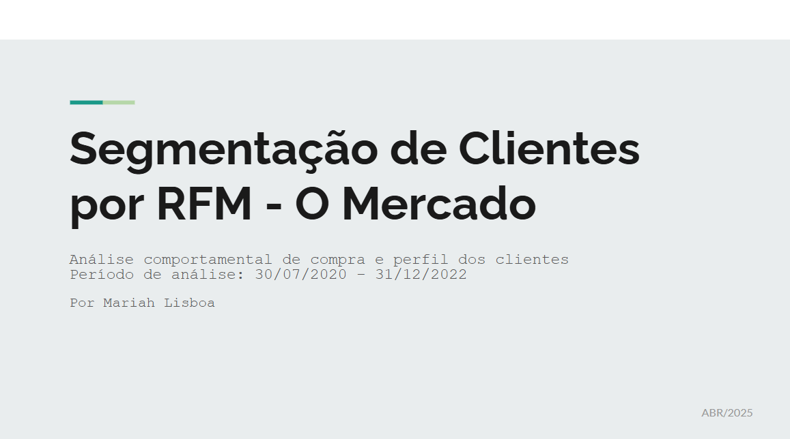

  

# Segmentação de Clientes por RFM
### Abril/2025

### Equipe: Mariah Lisboa

## Contexto

A loja “O Mercado” está num ambiente altamente competitivo e está experimentando mudanças significativas nas preferências dos consumidores.
A fidelização do cliente tornou-se um desafio e a loja em questão está a procura de manter e aumentar o seu rendimento através de uma melhor
compreensão de sua base de clientes e personalização de suas estratégias de marketing e retenção.

## Objetivo

Analisar o perfil e o comportamento de compra dos clientes de O Mercado, utilizando dados demográficos e o histórico de compras com a
finalidade de aplicar a técnica de segmentação RFM. O objetivo é compreender de forma mais profunda os diferentes perfis de clientes e,
assim, propor ações personalizadas focadas em fidelização, retenção e estratégias de marketing que atendam às necessidades específicas de
cada grupo.

  
<strong>🔍 O que é a Análise RFM?</strong>

   
  RFM é uma técnica que avalia clientes com base em três critérios:

  - **Recência (R)**: há quanto tempo o cliente fez a última compra.
  - **Frequência (F)**: com que frequência ele compra.
  - **Valor Monetário (M)**: quanto ele gasta no total.

  Usamos isso para segmentar clientes e propor estratégias personalizadas!

  
<strong>⚙️ Ferramentas e Tecnologias: </strong>

   
  
Neste projeto, foi utilizado o **Google Sheets** para a manipulação, estruturação e modelagem dos dados. A etapa de visualização foi realizada
no **Looker Studio**, com painéis interativos para análise exploratória e apresentação dos resultados. O **Notion** foi utilizado para
organização das tarefas, documentação das etapas e elaboração do relatório técnico final.

  - **Linguagem de programação:** Google Sheets;
  - **Ferramentas de visualização:** Google Slides e Looker Studio;
  - **Outras tecnologias:** Notion (gerenciamento de tempo e progresso);  
                            Google Documentos (ficha técnica)

  
<strong>📂 Processamentos e Análises: </strong>

   
  
Após a limpeza inicial dos dados, foram aplicadas as métricas de **Recência, Frequência e Valor Monetário** para cada cliente. Com base na
pontuação relativa de cada dimensão, os clientes foram classificados e segmentados em grupos comportamentais. Essa análise permitiu identificar
perfis prioritários, como clientes leais, inativos ou de alto valor.
  
  - **Limpeza dos dados** 
  - **Exploração** 
  - **Análises Aplicadas** 

  
<strong>📈 Resultados e conclusões: </strong>

   

A aplicação da Análise RFM permitiu identificar padrões relevantes no comportamento dos clientes. As conclusões sugerem ações personalizadas para cada segmento,
melhorando o relacionamento e potencializando o retorno sobre campanhas.

## 🔗 Links Úteis:
 

  - 📘 [Relatório Documentado (Notion)](https://www.notion.so/Segmenta-o-RFM-2247ef1bfdb78011af2ec630e034de8b?source=copy_link)
  - 📊 [Dashboard Interativo (Looker Studio)](https://lookerstudio.google.com/reporting/c47af00f-3e3a-4816-b2b4-101a918f9ba5)
  - 🎞️ [Vídeo-Apresentação (Loom)](https://www.loom.com/share/eea7f2834d8b4c339dfd27cf76b4df2e?sid=41ea5cfa-d685-4451-92e4-5bfe6e01b15e)
  - 🗂️ [Link para o Sheets (Google Sheets)](https://docs.google.com/spreadsheets/d/1iYs8psxd5xN4FjWl0GQGjNNgHb10_m10Z-5Iez0SpI8/edit?usp=sharing)

  
